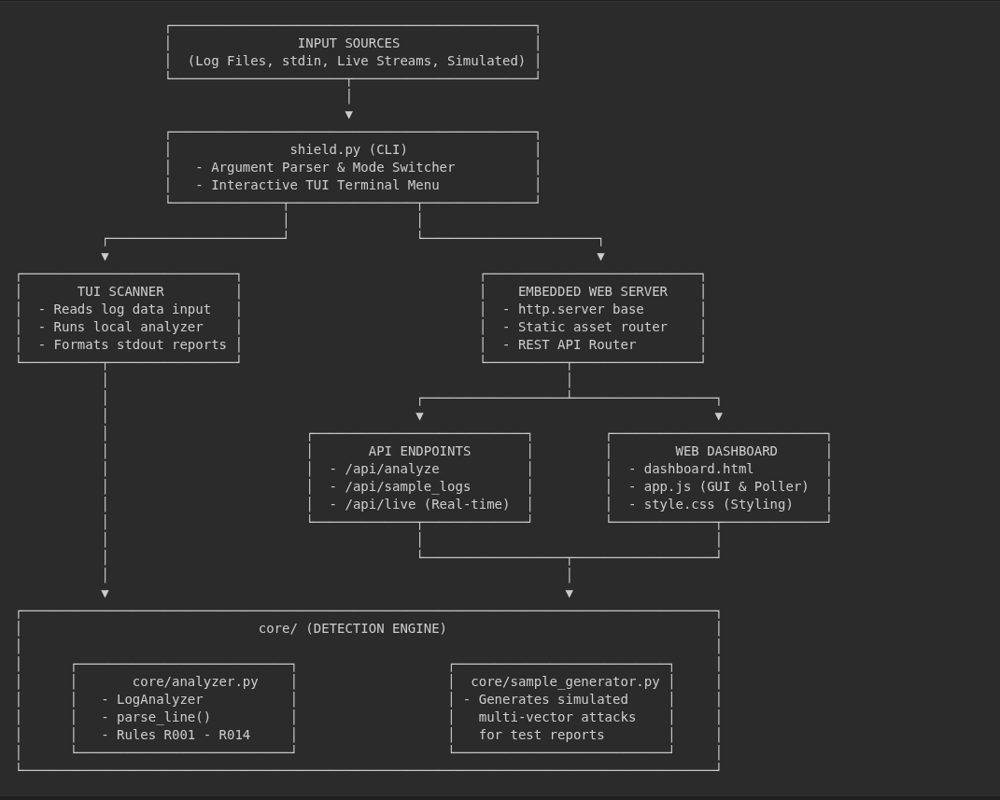
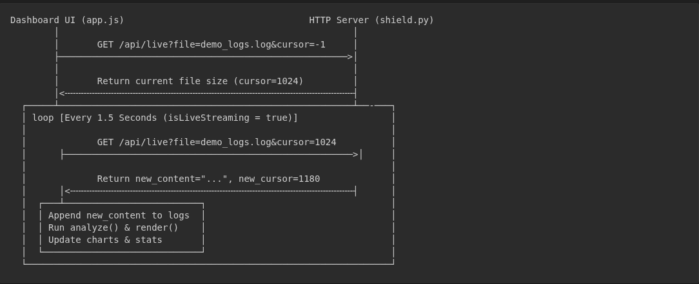
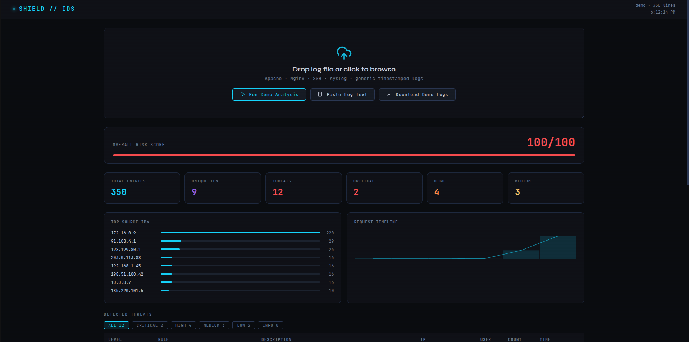
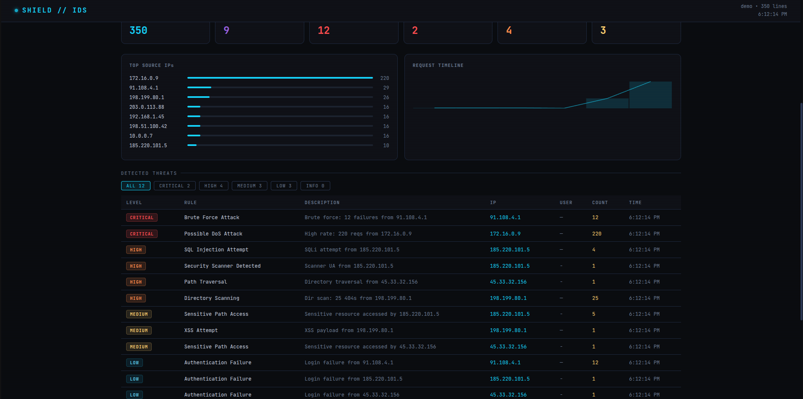
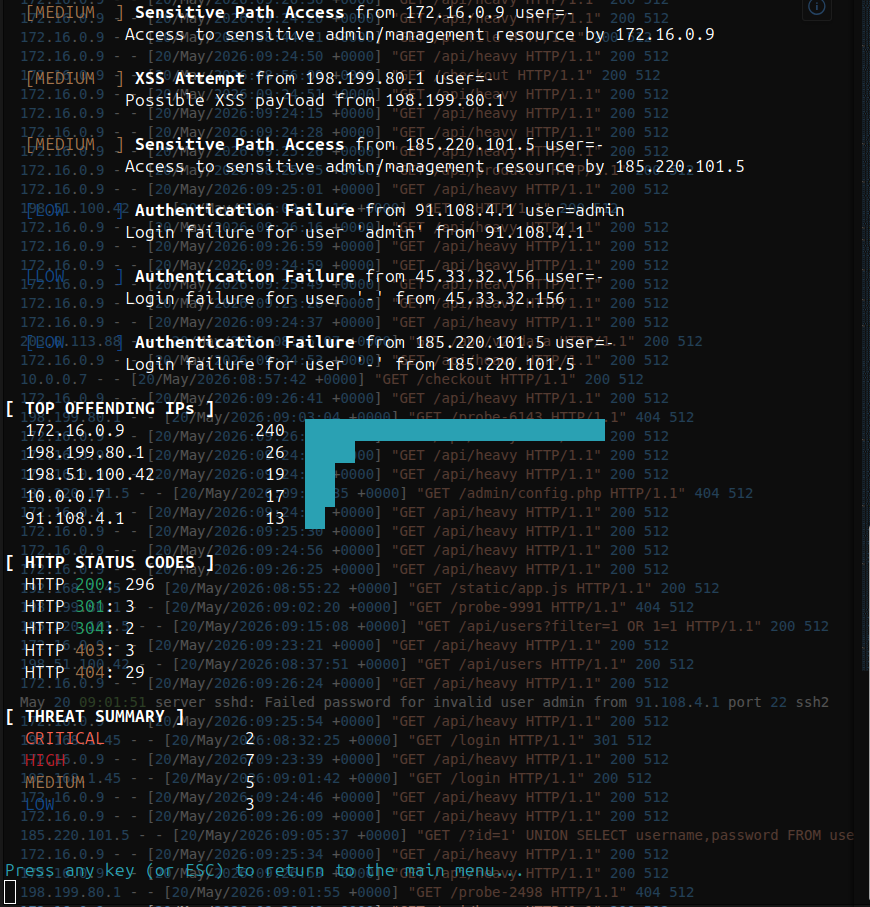
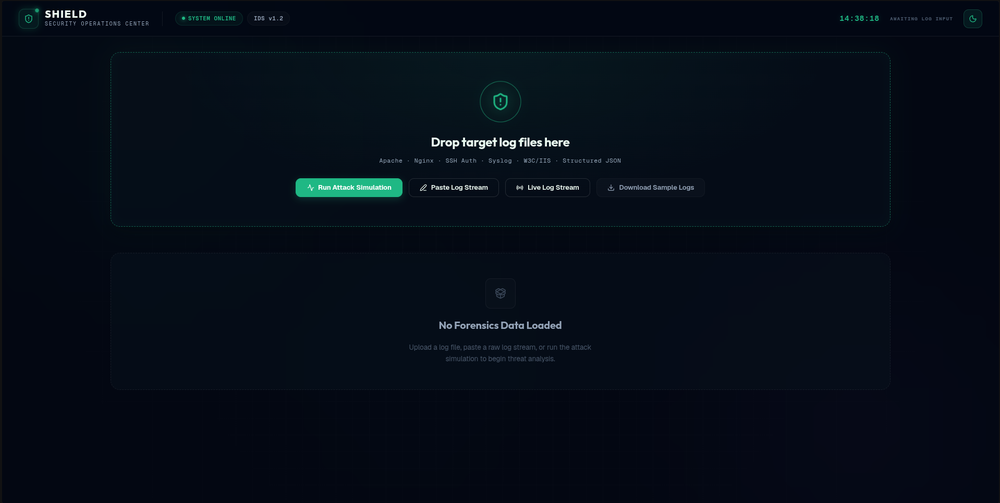
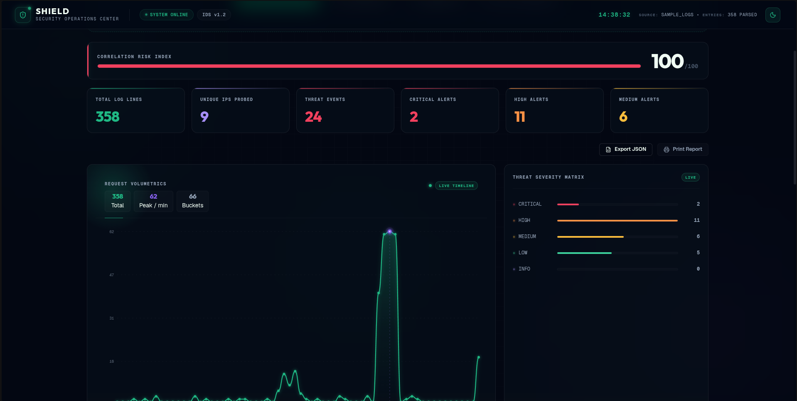
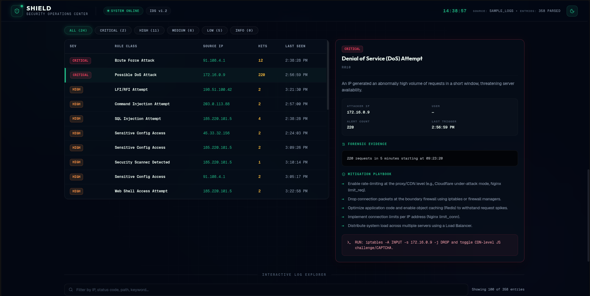
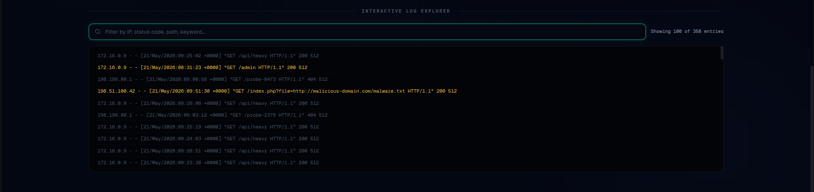
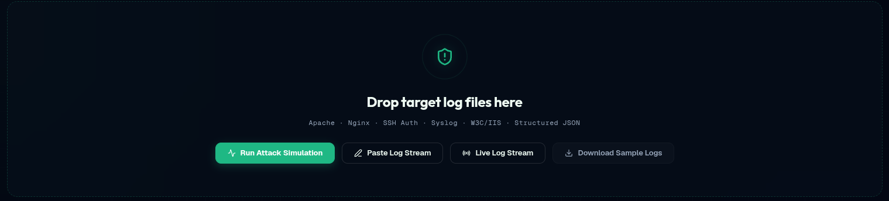

# SHIELD — Log Analyzer & Intrusion Detection System

A Python-based cybersecurity tool for detecting threats in web server and auth logs.

---

## Project Structure

```
log_ids/
├── shield.py              # CLI entry point
├── dashboard.html         # Browser-based visual dashboard
├── core/
│   ├── analyzer.py        # Detection engine + log parsers
│   └── sample_generator.py  # Demo log generator (attack simulations)
└── reports/               # Output directory for JSON reports
```

---

## Key Features

- **Interactive Terminal TUI**: Navigable console interface using arrow keys for running demo attacks, generating sample logs, and viewing reports directly.
- **Comprehensive Rule Detection Engine**: Detects 14+ security threat classes including SQLi, XSS, LFI/RFI, Path Traversal, Brute Force, Web Shells, and Command Injection.
- **Interactive Web Dashboard**: Beautiful dark-themed visual portal displaying threat severity breakdowns, timelines, and top offender statistics.
- **Forensic Inspector**: Dedicated sidebar in the dashboard showing raw matched evidence, mitigation steps, and commands for rapid response.
- **Real-Time Live Streaming**: High-performance, incremental byte-offset cursor polling to capture and stream live server events.
- **Attack Simulations**: One-click demo generation to simulate multi-vector attacks and test defensive capabilities.
- **SIEM & Pipeline Ready**: Clean stdout formatting, custom reports output, and pipe compatibility (`--stdin`) for CI/CD or logging pipelines.

---

## System Architecture & Data Flow

### Overall System Design
The application consists of a Terminal User Interface (TUI), an embedded Web Server, a JavaScript Web Dashboard, and a Python Detection Engine (`core/analyzer.py`):



### Real-Time Live Log Polling Loop
When live log streaming is active, the dashboard polls the embedded web server incrementally utilizing the byte-offset cursor:



---
## Quick Start

### Interactive Menu (Recommended)
Run the script without any arguments to open the interactive Terminal User Interface:
```bash
python3 shield.py
```
**Controls:**
* `↑` / `↓` (Arrow Keys) — Navigate menu options
* `Enter` — Select/confirm choice
* `Escape` — Cancel, go back, or exit menu

---

### CLI Command Line Usage
```bash
# Run with generated demo logs (showcases all detection rules)
python shield.py --demo

# Analyze a real log file
python shield.py -f /var/log/nginx/access.log

# Analyze with verbose evidence output
python shield.py --demo --verbose

# Save a JSON report
python shield.py -f access.log -o reports/report.json

# Read from stdin (pipe-friendly)
cat /var/log/auth.log | python shield.py --stdin

# Output raw JSON only (CI/CD integration)
python shield.py --demo --json-only
```

---

## Detection Rules

| Rule ID | Name                    | Level    | Trigger                                |
|---------|-------------------------|----------|----------------------------------------|
| R001    | SQL Injection Attempt   | HIGH     | SQLi patterns in URL / body            |
| R002    | XSS Attempt             | MEDIUM   | Script/event handler injection         |
| R003    | Path Traversal          | HIGH     | `../` or encoded variants              |
| R004    | Sensitive Path Access   | MEDIUM   | Access to admin or actuator endpoints  |
| R005    | Security Scanner        | HIGH     | Known scanner user-agent strings       |
| R006    | Authentication Failure  | LOW      | SSH/HTTP auth failure logs / HTTP 401  |
| R007    | Server Error            | LOW      | HTTP 5xx responses                     |
| R008    | Brute Force Attack      | CRITICAL | ≥5 failures from 1 IP in 5 min        |
| R009    | Directory Scanning      | HIGH     | ≥20 404s from 1 IP in 5 min           |
| R010    | Possible DoS Attack     | CRITICAL | ≥200 requests from 1 IP in 5 min      |
| R011    | LFI/RFI Attempt         | HIGH     | Local/Remote File Inclusion patterns   |
| R012    | Command Injection       | HIGH     | OS command injection shell syntax      |
| R013    | Web Shell Access        | HIGH     | Access attempts targeting web shells   |
| R014    | Sensitive Config Access | HIGH     | Downloading backups or credentials     |

---

## Supported Log Formats

- **Apache / Nginx** combined access log
- **SSH / syslog** auth logs (`/var/log/auth.log`, `/var/log/secure`)
- **JSON** - Structured JSON log format (`ip`/`client_ip`, `user`, `path`/`uri`, `status`, `message`, `timestamp`)
- **Generic** ISO timestamp + message
- **Custom** — falls back to IP extraction from any line

---

## Dashboard

Open `dashboard.html` in any browser. No server required.

- Upload any log file (drag & drop)
- Paste raw log text
- Click **Run Demo Analysis** for a pre-loaded attack simulation
- Filter threats by severity level
- Timeline and top-IP charts auto-render

---

## Exit Codes

| Code | Meaning                          |
|------|----------------------------------|
| 0    | No HIGH/CRITICAL threats         |
| 1    | HIGH or CRITICAL threats found   |

Use in CI/CD: `python shield.py -f access.log || alert_security_team`

---

## Extending

Add new detection rules in `core/analyzer.py`:

```python
def _check_my_rule(self, e: LogEntry):
    if "badpattern" in (e.path or "").lower():
        self._emit("R011", "My Rule Name", ThreatLevel.HIGH,
                   f"Bad pattern from {e.ip}", e)
```

Then call `self._check_my_rule(e)` inside `feed()`.

---

## Work Proof (Screenshots)

### Terminal User Interface (TUI)

#### Interactive CLI Menu


#### Log Analysis Report Summary


#### Log Analysis Report Statistics


---

### Visual Web Dashboard

#### Dashboard Landing & Initial State


#### Real-time Metrics & Volumetric Charts


#### Threat Center & Forensic Inspector


#### Interactive Log Explorer & Live Feed


#### Scan Operations Control Tray


